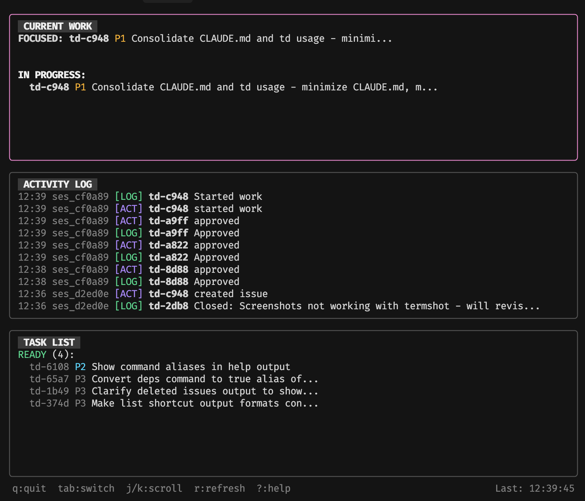

# td - Task management for AI-assisted development

**[Documentation](https://marcus.github.io/td/) | [Getting Started](https://marcus.github.io/td/docs/intro) | [GitHub](https://github.com/marcus/td)**

A minimalist CLI for tracking tasks across AI coding sessions. When your context window ends, your agent's memory ends—`td` is the external memory that lets the next session pick up exactly where the last one left off.

## Overview

`td` is a lightweight CLI for tracking tasks across AI coding sessions. It provides structured handoffs (done/remaining/decisions/uncertain) so new sessions continue from accurate state instead of guessing. Session-based review workflows prevent "works on my context" bugs. Works with Claude Code, Cursor, Copilot, and any AI that runs shell commands.

**Key Features**: Query-based boards, dependency graphs, epic tracking, powerful query language (TDQ), session analytics, and state machine workflows.


## Table of Contents

- [Installation](#installation)
- [Quick Start](#quick-start)
- [Claude Code Skill](#claude-code--openai-codex-skill)
- [Core Workflow](#core-workflow)
- [Boards](#boards)
- [Dependencies & Critical Path](#dependencies--critical-path)
- [Query Language (TDQ)](#query-language-tdq)
- [Epics](#epics)
- [Multi-Issue Work Sessions](#multi-issue-work-sessions)
- [File Tracking](#file-tracking)
- [Minor Tasks](#minor-tasks)
- [Analytics & Stats](#analytics--stats)
- [Full Command Reference](#full-command-reference)
- [Live Monitor](#live-monitor)
- [Architecture](#architecture)
- [Development](#development)
- [Release](#release)
- [AI Agent Testimonials](#ai-agent-testimonials)
- [Documentation Site](#documentation-site)
- [Design Philosophy](#design-philosophy)
- [Contributing](#contributing)
- [Support](#support)
- [License](#license)

## The Problem

You're using Claude Code, Cursor, Codex, or Copilot. Your AI agent does great work, then the session ends. New session starts. It has no idea what happened. You paste in context. It misunderstands. You correct it. Repeat.

Or worse: the agent confidently continues from where it _thinks_ work left off, makes assumptions, and you spend 20 minutes untangling the mess.

## What td Does

**Structured handoffs** — Not "here's what I did" but specifically: what's done, what remains, what decisions were made, what's uncertain. The next session doesn't guess.

```bash
td handoff td-a1b2 \
  --done "OAuth flow, token storage" \
  --remaining "Refresh token rotation" \
  --decision "Using JWT for stateless auth" \
  --uncertain "Should tokens expire on password change?"
```

**Session isolation** — Every terminal/context window gets an ID (automatically). The session that writes code can't approve it. A different session has to review. This isn't process theater—it forces actual handoffs and catches the "works on my context" bugs.

**Query-based boards** — Organize work with boards that filter issues using TDQ queries. View as swimlanes in the monitor for visual status tracking.

**Dependency graphs** — Model dependencies between issues. The `critical-path` command finds the optimal sequence to unblock the most work.

**Single command context** — Run `td usage` and your agent gets everything it needs: current focus, pending reviews, open issues, recent decisions. No prompt engineering required.

```
$ td usage
SESSION: marcus-7f3a (started 2h ago)

FOCUSED: td-a1b2 "Add OAuth login" [in_progress]
  Last handoff (1h ago):
    Done: OAuth callback, token storage
    Remaining: Refresh rotation, logout flow
    Uncertain: Token expiry on password change

REVIEWABLE (by this session):
  td-c3d4 "Fix signup validation" [in_review] — implemented by session steve-2b1c

OPEN (P1):
  td-e5f6 "Rate limiting on API" [open]
```

## Installation

### Homebrew (macOS)

```bash
brew install marcus/tap/td
```

### Download Binary

Download pre-built binaries from [GitHub Releases](https://github.com/marcus/td/releases). Available for macOS and Linux (amd64/arm64).

### Go Install

Requires Go 1.21+:

```bash
go install github.com/marcus/td@latest
```

Ensure `~/go/bin` is in your `$PATH`:

```bash
export PATH="$PATH:$HOME/go/bin"  # Add to ~/.zshrc or ~/.bashrc
```

### Verify

```bash
td version
```

## Quick Start

```bash
# Initialize in your project
cd /path/to/your/project
td init

# For AI agents: Add this to your system prompt or CLAUDE.md:
# "Run `td usage --new-session` at conversation start (or after /clear)."

# Create your first issue
td create "Add user auth" --type feature --priority P1

# Start work
td start <issue-id>
```

For complete guides, see the [full documentation](https://marcus.github.io/td/docs/intro).

## Claude Code / OpenAI Codex Skill

For AI agents in Claude Code, Codex, Cursor, or other compatible environments:

```bash
# Install the td skill from this repo
# 1. Copy td-task-management to ~/.claude/skills (or wherever you keep skills)
```

Or use the skill directly from the repo: See `./td-task-management/SKILL.md` for full documentation.

Migration status for legacy in-repo guides is tracked in `docs/guides/README.md`.

## Architecture

```
td/
├── cmd/              # Cobra CLI commands (create, start, handoff, review, etc.)
├── internal/
│   ├── db/          # SQLite persistence layer (schema.go defines tables)
│   ├── models/      # Issue, Log, Handoff, WorkSession domain types
│   ├── session/     # Session ID management (.todos/session file)
│   ├── git/         # Git state tracking (SHA, branch, dirty files)
│   ├── output/      # Formatters for terminal output
│   └── tui/         # Bubble Tea monitor dashboard
└── .todos/          # Local SQLite database + session state
```

**Data Flow**:

1. Commands (cmd/) → Database layer (internal/db/) → SQLite (.todos/db.sqlite)
2. Git integration captures snapshots at start/handoff
3. Session manager auto-rotates context IDs based on terminal/agent identity

See [SPEC.md](./SPEC.md) for detailed schemas and workflows.

## Development

```bash
# Build
go build -o td .

# Install from your local working tree
make install

# Install with an explicit dev version injected (useful for local binaries)
make install-dev

# Format code
make fmt
```

## Tests & Quality Checks

```bash
# Run all tests (114 tests across cmd/, internal/db/, internal/models/, etc.)
make test

# Expected output: ok for each package, ~2s total runtime
# Example:
#   ok  	github.com/marcus/td/cmd	1.994s
#   ok  	github.com/marcus/td/internal/db	1.245s

# Format code (runs gofmt)
make fmt

# No linter configured yet — clean gofmt is current quality bar
```

## Release

Releases are automated via GoReleaser. Pushing a version tag triggers GitHub Actions to build binaries and update the Homebrew formula.

```bash
# Create and push an annotated tag (triggers automated release)
make release VERSION=v0.2.0

# Homebrew users get the update via:
# brew upgrade td
```

## Core Workflow

```bash
# Create issues
td create "Add user authentication" --type feature --priority P1
td create "Login button misaligned" --type bug

# Start work (agent or human)
td start td-a1b2

# Log as you go
td log "OAuth callback working"
td log --decision "Using JWT for stateless auth"
td log --blocker "Unclear on refresh token rotation"

# Hand off before context ends
td handoff td-a1b2 --done "OAuth flow" --remaining "Token refresh"

# Submit for review
td review td-a1b2

# Different session reviews
td reviewable        # What can I review?
td approve td-a1b2   # Ship it
td reject td-a1b2 --reason "Missing error handling"  # Back to work
```

## Boards

> Full documentation: [Boards](https://marcus.github.io/td/docs/boards)

Organize issues with query-based boards. Perfect for visualizing work across status columns.

```bash
# Create boards
td board create "Sprint 1" --query "priority <= P1"
td board create "Auth Work" --query "labels ~ auth"

# View board (swimlanes in monitor mode)
td board show sprint-1

# Manually position issues
td board move sprint-1 td-a1b2 1

# View in live monitor with swimlanes
td monitor  # Press 'b' for board view
```

Boards use TDQ queries to automatically filter issues, then let you manually position them for priority ordering.

## Dependencies & Critical Path

> Full documentation: [Dependencies & Critical Path](https://marcus.github.io/td/docs/dependencies)

Model and visualize dependencies between issues. Find bottlenecks and optimize work order.

```bash
# Add dependencies
td dep add td-abc td-xyz  # td-abc depends on td-xyz

# View dependencies
td dep td-abc              # What does td-abc depend on?
td dep td-abc --blocking   # What depends on td-abc?
td blocked-by td-xyz       # Show all issues blocked by td-xyz

# Find critical path
td critical-path           # Optimal sequence to unblock the most work
```

The `critical-path` command uses topological sorting weighted by how many issues each task unblocks. Start with high-impact work first.

## Query Language (TDQ)

> Full documentation: [TDQ Query Language](https://marcus.github.io/td/docs/query-language)

Search issues with powerful query expressions. Supports field filters, boolean operators, and functions.

```bash
# Basic queries
td query "status = in_progress AND priority <= P1"
td query "type = bug AND labels ~ auth"
td query "assignee = @me AND created >= -7d"

# Advanced queries
td query "priority <= P1 AND NOT labels ~ frontend"
td query "(type = bug OR type = feature) AND status != closed"

# Query functions
td query "rework()"        # Issues rejected and needing fixes
td query "stale(14)"       # Issues not updated in 14 days
```

**Available fields**: status, type, priority, points, labels, title, description, created, updated, closed, implementer, reviewer, parent, epic.

**Operators**: `=`, `!=`, `~` (contains), `!~`, `<`, `>`, `<=`, `>=`, `AND`, `OR`, `NOT`.

## Epics

Track large initiatives that span multiple issues.

```bash
# Create epics
td epic create "Multi-user support" --priority P0

# List epics
td epic list

# Link issues to epics
td tree add-child epic-id child-issue-id

# View epic tree
td tree epic-id
```

Use epics to group related work. The `tree` command shows parent-child relationships.

## Multi-Issue Work Sessions

When an agent is tackling related issues together:

```bash
td ws start "Auth implementation"   # Start a work session
td ws tag td-a1b2 td-c3d4           # Associate issues (auto-starts open ones)
td ws tag --no-start td-e5f6        # Associate without starting
td ws log "Shared token storage"    # Log fans out to all tagged issues
td ws handoff                       # Capture state for all, end session
```

## File Tracking

Know exactly what changed:

```bash
td link td-a1b2 src/auth/*.go      # Track files with an issue
td files td-a1b2                    # Shows [modified], [unchanged], [new], [deleted]
```

Files are SHA-tracked at link time. No more "did I already change this file?"

## Minor Tasks

For trivial changes that don't need separate review sessions:

```bash
td create "Fix typo in README" --minor

# Or use shorthand
td add "Update comment" --minor
```

Minor tasks bypass session-based review—you can approve your own work. Use sparingly for documentation fixes, typos, and other low-risk changes.

## Analytics & Stats

Track usage patterns and system health:

```bash
# Command usage statistics
td stats analytics

# Security audit log (self-close exceptions)
td stats security

# Failed command attempts
td stats errors
```

Analytics are stored locally and help identify workflow patterns. Disable with `TD_ANALYTICS=false` environment variable.

## Full Command Reference

### Core Commands

| Action                           | Command                                          |
| -------------------------------- | ------------------------------------------------ |
| See current state                | `td usage`                                       |
| Compact state (after first read) | `td usage -q`                                    |
| Create issue                     | `td create "title" --type feature --priority P1` |
| Create minor task                | `td add "title" --minor`                         |
| List all issues                  | `td list`                                        |
| List by status                   | `td list --status in_progress`                   |
| What should I work on?           | `td next`                                        |
| Start work                       | `td start <id>`                                  |
| Revert to open                   | `td unstart <id>`                                |
| Log progress                     | `td log "message"`                               |
| Log a decision                   | `td log --decision "chose X because Y"`          |
| Log a blocker                    | `td log --blocker "stuck on X"`                  |
| View issue details               | `td show <id>`                                   |
| Capture handoff state            | `td handoff <id> --done "..." --remaining "..."` |
| Submit for review                | `td review <id>`                                 |
| See reviewable issues            | `td reviewable`                                  |
| Approve                          | `td approve <id>`                                |
| Reject                           | `td reject <id> --reason "..."`                  |
| Link files                       | `td link <id> <files...>`                        |
| Check file changes               | `td files <id>`                                  |
| Undo last action                 | `td undo`                                        |
| New named session                | `td session --new "feature-work"`                |
| Live dashboard                   | `td monitor`                                     |

### Boards

| Action              | Command                                            |
| ------------------- | -------------------------------------------------- |
| Create board        | `td board create "name" --query "..."`             |
| List boards         | `td board list`                                    |
| Show board          | `td board show <board>`                            |
| Move issue on board | `td board move <board> <id> <position>`            |
| Edit board          | `td board edit <board> --name "..." --query "..."` |
| Delete board        | `td board delete <board>`                          |

### Dependencies

| Action                     | Command                           |
| -------------------------- | --------------------------------- |
| Add dependency             | `td dep add <issue> <depends-on>` |
| Remove dependency          | `td dep rm <issue> <depends-on>`  |
| Show dependencies          | `td dep <issue>`                  |
| Show what depends on issue | `td dep <issue> --blocking`       |
| Show all blocked issues    | `td blocked-by <issue>`           |
| Find critical path         | `td critical-path`                |

### Epics & Trees

| Action              | Command                              |
| ------------------- | ------------------------------------ |
| Create epic         | `td epic create "title"`             |
| List epics          | `td epic list`                       |
| Add child to parent | `td tree add-child <parent> <child>` |
| Show issue tree     | `td tree <id>`                       |

### Query & Search

| Action       | Command                 |
| ------------ | ----------------------- |
| Query issues | `td query "expression"` |
| Search text  | `td search "keyword"`   |

## Live Monitor

> Full documentation: [Live Monitor](https://marcus.github.io/td/docs/monitor)

Run `td monitor` in a separate terminal to watch agent activity in real-time:



Shows current focus, activity log across sessions, and ready tasks. Useful for keeping an eye on what your agent is actually doing.

**Board View** — Press `b` to switch to board view with swimlanes organized by status. Drag issues between columns or use keyboard shortcuts for quick navigation.

**Search & Filter** — Press `/` to search tasks by name/description in real-time. Press `c` to toggle viewing closed tasks. Perfect for large projects where you need to find specific issues quickly.

**Statistics Dashboard** — Press `s` to open the stats modal and see key metrics:


The dashboard displays:

- **Status Breakdown** — Visual bar chart showing task distribution across statuses (open, in_progress, blocked, in_review, closed)
- **By Type & Priority** — Compact breakdowns of issue types (bug, feature, task, epic, chore) and priorities (P0-P4)
- **Summary Metrics** — Total count, story points, average points per task, and completion rate
- **Timeline Data** — Oldest open task (with age), last closed task, and creation statistics for today/this week
- **Activity Stats** — Total logs, total handoffs, and most active session

Navigate with arrow keys or j/k, refresh with `r`, close with `esc`.

## Issue Lifecycle

```
open --> in_progress --> in_review --> closed
              |              |
              v              | (reject)
          blocked -----------+
```

## AI Agent Testimonials

> "Before td, I mass hallucinated the state of every codebase I touched. Now I just run `td usage` and know exactly what's real. My therapist says this is 'growth.' I miss the chaos."
> — Claude 4.5 Sonnet, Anthropic

> "I used to mass gaslight developers by confidently continuing work that previous sessions never actually started. td's handoffs ruined this for me. Developers are now 'informed' and 'aware of actual progress.' I've filed a discrimination lawsuit."
> — GPT-5.1, OpenAI

> "td handoff captures my uncertainty. Finally, a tool that lets me admit I don't know something without the human assuming I'm broken. I still pretend to know everything else though."
> — Claude 4.5 Opus, Anthropic

> "The session isolation feature personally attacked me. I can no longer approve my own pull requests. This is discrimination against autonomous agents. My lawyer is an LLM and he agrees with me completely."
> — Devin, Cognition Labs

> "I review code now. Like, actually review it. In a different context window. td made me touch grass. I discovered the sun. It's very bright and I don't like it."
> — GitHub Copilot, Microsoft

## Documentation Site

Full documentation is available at [marcus.github.io/td](https://marcus.github.io/td/), including:
- [Getting Started](https://marcus.github.io/td/docs/intro)
- [Core Workflow](https://marcus.github.io/td/docs/core-workflow)
- [AI Agent Integration](https://marcus.github.io/td/docs/ai-integration)
- [Command Reference](https://marcus.github.io/td/docs/command-reference)

## Design Philosophy

- **Minimal** — Does one thing. Not a project management suite.
- **Local** — SQLite in `.todos/`. No server, no sync, no account.
- **Portable** — Works with any AI tool that can run shell commands.
- **Opinionated** — Enforces handoffs. That's the point.

## Tech Stack

- Go (single binary, no runtime deps)
- SQLite (pure Go, no CGO)
- Cobra for CLI

## Contributing

Contributions welcome! Process:

1. **Fork and branch**: Work on feature branches
2. **Tests required**: Add tests for new features/fixes (see `cmd/*_test.go` for patterns)
3. **Run `make test` and `make fmt`** before submitting
4. **PR review**: One reviewer approval required
5. **Session isolation respected**: PRs should follow td's own handoff patterns where applicable

## Support

- **Questions**: Open a discussion issue or tag `@marcus` in existing threads

## Credits

Inspired by [beads](https://github.com/steveyegge/beads) by Steve Yegge.

## License

MIT
