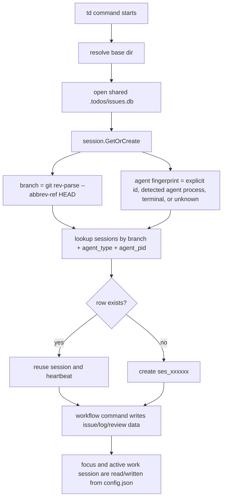

# Plan: Session and Worktree Flow Revisit

Status: proposed
Created: 2026-06-19
Related: docs/plans/orchestrator-review-closure-plan.md, docs/plans/review-policy-trusted-mode-plan.md, docs/multi-agent-ui-review.md

## Summary

td has three different concepts that currently overlap in user workflows:

- **Session**: the audit identity used for creator, implementer, reviewer, closer, logs, handoffs, and undo.
- **Work session**: an optional multi-issue container for batching related work and handoffs.
- **Worktree**: the filesystem checkout where the agent actually edits and tests code.

The current model works for one agent in one checkout, and mostly works for separate agents on separate branches. It gets fragile when multiple agents operate across worktrees, especially if two checkouts share the same branch, the same long-lived agent process, or the same shared `.todos` database. The fix should be to make worktree identity explicit and to stop storing per-agent working state in global project config.

Recommended direction:

1. Add a stable `worktree_id` / `worktree_root` dimension to sessions and work sessions.
2. Key current focus and active work session by session or workspace context instead of one global project value.
3. Introduce agent lineage as a separate concept from session ID so `/clear`, `td usage --new-session`, and review policy can reason about continuity without pretending every new context is unrelated.
4. Keep review attestation semantics, but evaluate independence against explicit roles and implementation history, not accidental session reuse.

## Current Flow



### Base Directory and Worktrees

`workdir.ResolveBaseDir` is designed to share a main repo's `.todos` database from external git worktrees. It checks the current path, git top-level, associations, then the main worktree (`internal/workdir/workdir.go:17-70`, `internal/workdir/workdir.go:104-130`). Tests assert this behavior for external worktrees (`internal/workdir/workdir_test.go:73-121`, `cmd/workdir_test.go:167-183`).

That shared DB is the right default for cross-worktree visibility. The missing piece is that the shared DB does not store where a session or work session actually happened.

### Session Identity

`session.GetOrCreate` currently scopes sessions by git branch plus agent fingerprint (`internal/session/session.go:157-175`). The fingerprint is either:

- `TD_SESSION_ID`, treated as explicit identity
- known agent process ancestry, including Codex/Cursor/Claude
- terminal session markers
- unknown fallback

The row stores `branch`, `agent_type`, `agent_pid`, `context_id`, and `previous_session_id`, but no worktree root (`internal/session/session.go:142-154`, `internal/db/schema.go:122-153`).

`td usage --new-session` forces a new session and links `previous_session_id`, which is useful for context rotation (`cmd/context.go:52-59`, `cmd/context.go:131-145`). But review and involvement checks use exact session IDs, so previous sessions are mostly display/audit context rather than an identity lineage.

### Work Sessions and Focus

Work sessions are DB rows keyed to a session ID (`internal/db/schema.go:90-107`, `internal/db/work_sessions.go:15-45`). Starting a work session creates a DB row, then writes a single `active_work_session` value into `.todos/config.json` (`cmd/ws.go:50-78`).

Focus works the same way: a single `focused_issue_id` field lives in config (`internal/models/models.go:260-283`, `internal/config/config.go:100-149`). `td usage` reads those global config values before listing current in-progress work for the current session (`cmd/context.go:65-86`).

This means agents sharing the same `.todos` root can see each other's issue data, but they also overwrite each other's local "current focus" and "active work session" pointers.

### Review and Involvement

The review policy itself is in good shape compared with the session model. Current trusted mode distinguishes independent review from acknowledged self-review (`internal/reviewpolicy/policy.go:234-281`). Close eligibility can rely on an active approval review instead of the closer being the reviewer (`internal/reviewpolicy/policy.go:283-360`).

The weak point is the identity primitive. Involvement is recorded as exact `session_id` rows in `issue_session_history` (`internal/db/issue_relations.go:722-761`). If session identity is accidentally shared, independent work can look like one actor. If a session is intentionally rotated, related work can look like unrelated actors unless the issue fields still point at the prior implementer.

## Failure Modes

### 1. Same Agent, Same Branch, Different Worktrees Can Collapse

If the same long-lived agent process drives two worktrees on the same branch, the lookup key `(branch, agent_type, agent_pid)` can return the same session for both. This is especially plausible with desktop app orchestration or terminals multiplexed under the same parent process.

Impact:

- Issue implementer attribution can merge independent streams.
- Review eligibility can be too strict because separate worktrees look like the same implementer.
- Review eligibility can also be too loose after `--new-session` because there is no durable lineage check beyond exact session history.

### 2. Active Work Session Is Global Project State

`td ws start` refuses to start when `config.active_work_session` is already set, even if that work session belongs to a different agent or worktree. Conversely, `td ws handoff` or `td ws end` acts on the global active value, not "my" active value.

Impact:

- Parallel agents in one shared `.todos` project can block each other from starting work sessions.
- An agent can accidentally log to or end another agent's active work session.

### 3. Focus Is Global Project State

`td start <id>` sets focus for everyone in the shared project. `td handoff` and `td log` can infer from focus when an issue is omitted.

Impact:

- One agent can redirect another agent's implicit `td handoff` or `td log`.
- `td usage` can show a focused issue that belongs to another agent's workflow.

### 4. Branch Is Not a Strong Enough Location Key

Branch is useful, but it does not identify a checkout. Agents can work on:

- multiple worktrees with the same branch name, intentionally or by mistake
- detached HEADs
- branches with identical names in separate repos resolved to a common `.td-root`
- generated worktrees under orchestration tools

Impact:

- Audit output answers "which branch" but not "which checkout".
- Git snapshots record branch and commit, but not the worktree path or worktree identity.

### 5. Previous Session Is Underused

`previous_session_id` explains that a context rotated, but policy checks still ask "did this exact session ID touch the issue?" That was useful for old hard review walls. In the new trusted/delegated world, the more useful question is "is this the same agent lineage or the same implementation actor?"

Impact:

- A context reset can accidentally create review independence where humans would see continuity.
- The model still needs `--self-review` as an audit acknowledgement, but td lacks a clear way to say "this new session is the same agent lineage as the prior implementer."

## Recommended Model

### 1. Add Worktree Identity

Add fields to `sessions`, `work_sessions`, `git_snapshots`, and optionally `logs` / `handoffs`:

- `worktree_id TEXT DEFAULT ''`
- `worktree_root TEXT DEFAULT ''`
- `repo_root TEXT DEFAULT ''`

Suggested `worktree_id` algorithm:

1. Resolve current git top-level with `git rev-parse --show-toplevel`.
2. Resolve canonical absolute path with symlinks cleaned.
3. Hash that path to a compact stable ID, for example `wt_<8hex>`.
4. Store the readable path separately as `worktree_root`.

Do not use branch alone. Do not put full paths into primary keys.

Session lookup should become:

```text
branch + agent_fingerprint + worktree_id
```

For compatibility, migrate old rows with empty `worktree_id` and let lookup fall back to old behavior only when no worktree-scoped row exists. Emit a one-time warning when legacy fallback reuses an unscoped session in a detected worktree.

### 2. Split Global Config From Session-Scoped State

Keep project-level monitor preferences in `.todos/config.json`, but move mutable "current work" pointers into a session/worktree scoped store.

Recommended new table:

```sql
CREATE TABLE session_state (
    session_id TEXT NOT NULL,
    worktree_id TEXT DEFAULT '',
    focused_issue_id TEXT DEFAULT '',
    active_work_session_id TEXT DEFAULT '',
    updated_at DATETIME NOT NULL DEFAULT CURRENT_TIMESTAMP,
    PRIMARY KEY (session_id, worktree_id)
);
```

Behavior:

- `td focus`, `td start`, `td log` inference, `td handoff` inference, `td usage`, and `td ws current` read `session_state` first.
- Existing config values are read as legacy fallback for one release.
- `td monitor` can still have project-level UI filter state, but issue focus should be clearly either project focus or "my focus"; prefer "my focus" for agent workflow commands.

### 3. Make Agent Lineage Explicit

Add an `agent_instance_id` or `lineage_id` to `sessions`.

Purpose:

- A `session_id` remains a context-sized audit unit.
- A `lineage_id` represents a durable actor across `/clear`, `td usage --new-session`, and subprocesses.
- Review policy can distinguish exact-session actions from same-lineage actions when deciding whether a self-review acknowledgment is required.

Initial derivation can be conservative:

- If `TD_SESSION_ID` is set, use a sanitized or hashed value as lineage.
- Else if an agent-specific stable env var exists, use that.
- Else use detected agent process identity plus worktree ID.
- For `ForceNewSession`, carry forward the previous row's lineage ID.

Policy recommendation:

- Independent review should mean no implementation history by this `session_id` or lineage.
- Trusted self-review should trigger when the current session or current lineage implemented the issue.
- Existing `issue_session_history` can remain session-based, with helper queries joining through `sessions.lineage_id`.

### 4. Keep Shared DB, Improve Visibility

Do not split `.todos` per worktree by default. Shared issue state is the right product shape for coordinated agent work.

Instead, make cross-worktree state visible:

- `td session list` should show `branch`, `worktree_id`, short worktree path, agent, session, lineage, and last activity.
- `td usage` should show "current worktree" and only "my focus/work session" by default.
- Add `td usage --all-agents` or `td status --agents` for cross-agent state.
- Monitor should group in-progress issues by session/worktree, not only by status.

### 5. Add Directed Handoffs Later

Current handoffs are issue-scoped. That is enough for general context, but not enough for targeted multi-agent orchestration.

After session/worktree scoping is stable, add optional fields:

- `target_session_id`
- `target_lineage_id`
- `target_worktree_id`

Then add query helpers like:

- `td handoffs --for-me`
- `handoff.for(@me)` in TDQ

## Implementation Plan

### Phase 1: Worktree Detection and Display

- Add `internal/workdir.CurrentWorktree()` returning `repo_root`, `worktree_root`, and `worktree_id`.
- Add columns to `sessions`, `work_sessions`, and `git_snapshots`.
- Populate fields on new sessions/work sessions/snapshots.
- Update `td session list`, `td whoami`, and `td usage --json`.
- Tests: worktree identity differs for two worktrees, remains stable across subdirectories, and shared main DB resolution still works.

### Phase 2: Session Lookup Scope

- Change `GetSessionByBranchAgent` into `GetSessionByIdentity(branch, agent_type, agent_pid, worktree_id)`.
- Preserve legacy fallback for rows with empty `worktree_id`.
- Update session tests for same branch plus different worktrees.
- Add regression test for two worktrees on the same branch not sharing one session when worktree IDs differ.

### Phase 3: Session-Scoped Current State

- Add `session_state`.
- Route `focus`, `start`, `handoff`, `log`, `usage`, and `ws` current/active operations through DB-backed `session_state`.
- Keep config fallback read-only for one compatibility window.
- Add tests showing two sessions can each have their own focus and active work session.

### Phase 4: Lineage-Aware Review Policy

- Add `lineage_id` to sessions.
- Add DB helpers:
  - `WasLineageInvolved(issueID, lineageID)`
  - `WasLineageImplementationInvolved(issueID, lineageID)`
- Thread lineage facts into `reviewpolicy.ReviewerEligibilityInput` and `CloseEligibilityInput`.
- Trusted mode should require `--self-review` for same-lineage implementation, even if the exact session rotated.
- Tests: implement in session A, force new session B in same lineage, approve requires `--self-review`; independent session C does not.

### Phase 5: UI and Handoff Ergonomics

- Monitor current-work panel groups "mine in this worktree", "mine elsewhere", and "other agents".
- `td usage` shows a concise "other active agents" section without mixing their focus into yours.
- Add directed handoff fields and filters after the scoping primitives are stable.

## Open Decisions

1. Should `lineage_id` be visible by default, or only in `--json` / debug output?
2. Should `TD_SESSION_ID` mean exact session, lineage, or both? Recommendation: exact session override today should remain exact for compatibility; introduce `TD_LINEAGE_ID` for durable identity.
3. Should a worktree on a different branch but same path reuse the same current focus? Recommendation: no. Key current state by `(session_id, worktree_id)`, and sessions are already branch-scoped.
4. Should an agent be able to explicitly claim an existing session in another worktree? Recommendation: only via an explicit override flag/env with clear warning output, because accidental claim is the bug class we are trying to remove.

## Near-Term Tasks

- `td add "Add worktree identity to sessions" --type feature --priority P1`
- `td add "Make focus and active work sessions session-scoped" --type feature --priority P1`
- `td add "Add lineage-aware self-review detection" --type feature --priority P1`
- `td add "Show session/worktree ownership in usage and monitor" --type feature --priority P2`
- `td add "Add directed handoffs for multi-agent work" --type feature --priority P2`

## Recommendation

Start with worktree identity and session-scoped current state. Those changes remove the most dangerous confusion without disturbing the existing review-attestation model. Then add lineage-aware policy so `td usage --new-session` remains useful for context rotation without creating fake independence.

The product principle should be:

> Shared issue database, scoped working context, explicit audit identity.

That preserves what td is already good at while making multi-agent worktrees feel intentional instead of incidental.
