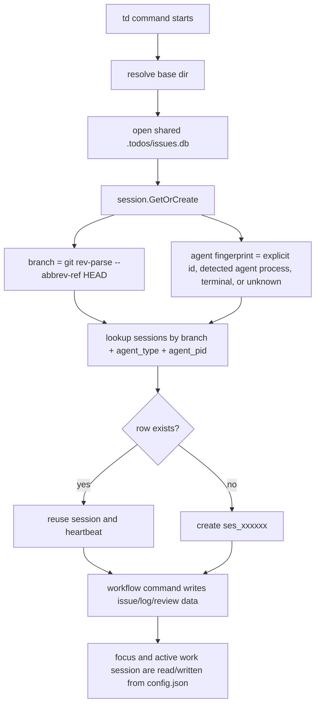

# Plan: Session and Worktree Flow Revisit

Status: partially scheduled — lean phase scoped into epic td-124499; session-scoped current-state follow-up scoped into epic td-af80e9 (2026-06-20)
Created: 2026-06-19
Related: docs/plans/orchestrator-review-closure-plan.md, docs/plans/review-policy-trusted-mode-plan.md, docs/multi-agent-ui-review.md

## Decision Log (2026-06-20, Current-State Expansion)

The user's current-context proposal is now expanded into a follow-up implementation epic: `td-af80e9` ("Session-scoped current state: DB-backed focus and work sessions"). This lives in this plan instead of a new document because the existing plan already owns the session/worktree architecture, and the new work implements previously deferred Recommended Model #1 and #2.

Scope boundaries for `td-af80e9`:

- **Proceed:** DB-backed `session_state` for `focused_issue_id` and `active_work_session_id`, scoped by `session_id + worktree_id`.
- **Proceed:** worktree-aware state scope, because current `workdir.ResolveBaseDir` shares one main `.todos` DB across worktrees but session/work-session rows still lack `worktree_id`.
- **Proceed:** CLI/API current-state migration for focus, start/resume, log, handoff, usage/status/current, `show`/`list` inference, `ws` active-work-session commands, and local `serve` focus handler.
- **Proceed:** one-release read-only compatibility fallback from config-backed `focused_issue_id` and `active_work_session`.
- **Proceed:** local-only/no sync for raw `session_state`.
- **Do not touch:** `pkg/monitor` in this implementation.
- **Do not touch:** `/Users/marcus/code/td-watch` in this implementation.
- **Defer:** lineage-aware review policy and directed handoffs.

Grounding updates from the current checkout:

- `TD_CONTEXT_ID` / `match_context_id` already landed. `internal/session/session.go` reads `TD_CONTEXT_ID`, stores `MatchContextID`, and `internal/db/sessions.go` looks up by `branch + agent_type + agent_pid + match_context_id`. Treat Phase 2b as baseline, not part of this follow-up epic.
- `internal/db/schema.go` is currently `SchemaVersion = 33`, and `sessions` has `match_context_id` but no `worktree_id`, `worktree_root`, or `repo_root`.
- `work_sessions` still stores only `id`, `name`, `session_id`, timestamps, and SHAs; `internal/db/work_sessions.go` does not persist worktree metadata.
- `internal/config/config.go` still owns `SetFocus/GetFocus/ClearFocus` and `SetActiveWorkSession/GetActiveWorkSession/ClearActiveWorkSession`, and the config model still has `focused_issue_id` and `active_work_session`.
- CLI call sites still read config-backed current state in `cmd/focus.go`, `cmd/context.go`, `cmd/status.go`, `cmd/start.go`, `cmd/log.go`, `cmd/handoff.go`, `cmd/show.go`, `cmd/list.go`, `cmd/review.go`, `cmd/unstart.go`, and `cmd/ws.go`.
- The local focus API is `internal/serve/handlers_write.go:HandleSetFocus`; it currently requires `ctx.BaseDir`, writes config, preserves response shape, and intentionally does not call `notifyChange`.
- Sync allowlisting is explicit: `cmd/sync.go` has `baseSyncableEntities`, and `session_state` must stay out of that map. It should also stay out of `internal/events/taxonomy.go` and td-sync project/admin entity surfaces.

Implementation sequence for `td-af80e9`:

1. `td-83cfc9` — Add worktree identity plumbing for session-scoped state.
   - Files/modules: `internal/workdir`, `internal/session`, `internal/db/schema.go`, `internal/db/migrations.go`, `internal/db/sessions.go`, `internal/db/work_sessions.go`, model structs as needed.
   - Add stable `worktree_id`, readable `worktree_root`, and `repo_root`; include `worktree_id` in session identity while preserving legacy empty-worktree fallback for one release.

2. `td-3d427b` — Add local-only `session_state` schema and helpers.
   - Files/modules: schema/migrations plus DB helpers for get/upsert/clear by `session_id + worktree_id`.
   - Table shape:

     ```sql
     CREATE TABLE session_state (
         session_id TEXT NOT NULL,
         worktree_id TEXT DEFAULT '',
         focused_issue_id TEXT DEFAULT '',
         active_work_session_id TEXT DEFAULT '',
         updated_at DATETIME NOT NULL DEFAULT CURRENT_TIMESTAMP,
         PRIMARY KEY (session_id, worktree_id)
     );
     ```

   - Keep `session_state` local-only: no sync taxonomy entry, no sync validator entry, no td-sync project/admin exposure.

3. `td-e2f1ab` — Migrate CLI current-state commands to `session_state`.
   - Files/modules: `cmd/focus.go`, `cmd/context.go`, `cmd/status.go`, `cmd/start.go`, `cmd/log.go`, `cmd/handoff.go`, `cmd/show.go`, `cmd/list.go`, `cmd/review.go`, `cmd/unstart.go`, `cmd/ws.go`, and corresponding command tests.
   - Writes go to `session_state`; fallback reads from config only when the scoped DB value is absent.

4. `td-dd7a11` — Migrate serve focus API to `session_state`.
   - Files/modules: `internal/serve/context.go`, `internal/serve/handlers_write.go`, local serve integration tests, and project-route wiring only if needed for existing tests.
   - Preserve the current local-root guard and response shape; do not invent remote synced focus state for td-sync.

5. `td-8ea327` — Remove config current-state writes after compatibility window.
   - Files/modules: compatibility helper and config/model cleanup after the release window.
   - Keep monitor preference config fields; only remove current-work pointers when safe.

6. `td-ae3a2a` — Proof: session_state current-context migration is isolated and green.
   - Label: `proof`.
   - Required proof: `env -u TD_FEATURE_SYNC_AUTOSYNC -u TD_FEATURE_SYNC_CLI GOWORK=off go test ./...`, focused DB/session/cmd/serve tests, two-session/two-worktree smoke against a shared `.todos` DB, sync-boundary assertions, and git status/diff proof that `pkg/monitor` and `/Users/marcus/code/td-watch` were not modified.

## Decision Log (2026-06-20)

A planning pass scoped a **lean first epic** (`td-124499`) and deferred the rest. Decisions:

- **Scope = lean.** Ship Phase 2b (context_id keying, Failure Mode #6) plus the two cheap "aged controls" cleanups. Defer worktree identity (Recommended Model #1), `session_state` (Model #2), lineage-aware policy (Phase 4), and directed handoffs (Phase 5) to follow-up epics.
- **Identity model = both, sequenced.** context_id keying is the shipping *mechanism* now; `td delegate` (explicit role declaration) is the eventual *canonical* model. `td delegate` is **spec-only** in this epic (`td-d7fd80`) so the two don't become two half-supported paths.
- **td-sync boundary.** When `session_state` lands (deferred), it is **local-only and must not sync** — it is per-machine working context. `sessions`/worktree columns may sync. Recorded as forward-guidance for the deferred Core epic.

Two corrections from grounding the plan against current code (2026-06-20):

- **The mandatory-handoff gate is already gone.** `td review` auto-creates a minimal handoff when none exists (`cmd/review.go:249-253`, `newAutoReviewHandoff`) and warns. The "Right-Size the Mandatory Handoff" item below is therefore a *content-quality* improvement (synthesize from logs) rather than gate removal — see `td-713b57`.
- **The title minimum is already a config field** (`DefaultTitleMinLength = 15`, `internal/config/config.go:19`, overridable via `TitleMinLength`). The "Relax Input-Validation Gates" item is just reject→warn — see `td-e76379`.

Epic `td-124499` children: `td-64dc09` (context_id keying, P1), `td-a616c2` (document interim TD_SESSION_ID pattern, P2), `td-d7fd80` (design `td delegate`, P2), `td-713b57` (synthesize auto-handoff, P2), `td-e76379` (title reject→warn, P3).

## Summary

td has three different concepts that currently overlap in user workflows:

- **Session**: the audit identity used for creator, implementer, reviewer, closer, logs, handoffs, and undo.
- **Work session**: an optional multi-issue container for batching related work and handoffs.
- **Worktree**: the filesystem checkout where the agent actually edits and tests code.

The current model works for one agent in one checkout, and mostly works for separate agents on separate branches. It gets fragile when multiple agents operate across worktrees, especially if two checkouts share the same branch, the same long-lived agent process, or the same shared `.todos` database. The fix should be to make worktree identity explicit and to stop storing per-agent working state in global project config.

Recommended direction:

1. Add a stable `worktree_id` / `worktree_root` dimension to sessions and work sessions.
2. Key current focus and active work session by session or workspace context instead of one global project value.
3. Introduce agent lineage as a separate concept from session ID so `/clear`, `td usage --new-session`, and review policy can reason about continuity without pretending every new context is unrelated.
4. Keep review attestation semantics, but evaluate independence against explicit roles and implementation history, not accidental session reuse.

## Current Flow



### Base Directory and Worktrees

`workdir.ResolveBaseDir` is designed to share a main repo's `.todos` database from external git worktrees. It checks the current path, git top-level, associations, then the main worktree (`internal/workdir/workdir.go:17-70`, `internal/workdir/workdir.go:104-130`). Tests assert this behavior for external worktrees (`internal/workdir/workdir_test.go:73-121`, `cmd/workdir_test.go:167-183`).

That shared DB is the right default for cross-worktree visibility. The missing piece is that the shared DB does not store where a session or work session actually happened.

### Session Identity

`session.GetOrCreate` currently scopes sessions by git branch plus agent fingerprint (`internal/session/session.go:157-175`). The fingerprint is either:

- `TD_SESSION_ID`, treated as explicit identity
- known agent process ancestry, including Codex/Cursor/Claude
- terminal session markers
- unknown fallback

The row stores `branch`, `agent_type`, `agent_pid`, `context_id`, and `previous_session_id`, but no worktree root (`internal/session/session.go:142-154`, `internal/db/schema.go:122-153`).

`td usage --new-session` forces a new session and links `previous_session_id`, which is useful for context rotation (`cmd/context.go:52-59`, `cmd/context.go:131-145`). But review and involvement checks use exact session IDs, so previous sessions are mostly display/audit context rather than an identity lineage.

### Work Sessions and Focus

Work sessions are DB rows keyed to a session ID (`internal/db/schema.go:90-107`, `internal/db/work_sessions.go:15-45`). Starting a work session creates a DB row, then writes a single `active_work_session` value into `.todos/config.json` (`cmd/ws.go:50-78`).

Focus works the same way: a single `focused_issue_id` field lives in config (`internal/models/models.go:260-283`, `internal/config/config.go:100-149`). `td usage` reads those global config values before listing current in-progress work for the current session (`cmd/context.go:65-86`).

This means agents sharing the same `.todos` root can see each other's issue data, but they also overwrite each other's local "current focus" and "active work session" pointers.

### Review and Involvement

The review policy itself is in good shape compared with the session model. Current trusted mode distinguishes independent review from acknowledged self-review (`internal/reviewpolicy/policy.go:234-281`). Close eligibility can rely on an active approval review instead of the closer being the reviewer (`internal/reviewpolicy/policy.go:283-360`).

The weak point is the identity primitive. Involvement is recorded as exact `session_id` rows in `issue_session_history` (`internal/db/issue_relations.go:722-761`). If session identity is accidentally shared, independent work can look like one actor. If a session is intentionally rotated, related work can look like unrelated actors unless the issue fields still point at the prior implementer.

## Failure Modes

### 1. Same Agent, Same Branch, Different Worktrees Can Collapse

If the same long-lived agent process drives two worktrees on the same branch, the lookup key `(branch, agent_type, agent_pid)` can return the same session for both. This is especially plausible with desktop app orchestration or terminals multiplexed under the same parent process.

Impact:

- Issue implementer attribution can merge independent streams.
- Review eligibility can be too strict because separate worktrees look like the same implementer.
- Review eligibility can also be too loose after `--new-session` because there is no durable lineage check beyond exact session history.

### 2. Active Work Session Is Global Project State

`td ws start` refuses to start when `config.active_work_session` is already set, even if that work session belongs to a different agent or worktree. Conversely, `td ws handoff` or `td ws end` acts on the global active value, not "my" active value.

Impact:

- Parallel agents in one shared `.todos` project can block each other from starting work sessions.
- An agent can accidentally log to or end another agent's active work session.

### 3. Focus Is Global Project State

`td start <id>` sets focus for everyone in the shared project. `td handoff` and `td log` can infer from focus when an issue is omitted.

Impact:

- One agent can redirect another agent's implicit `td handoff` or `td log`.
- `td usage` can show a focused issue that belongs to another agent's workflow.

### 4. Branch Is Not a Strong Enough Location Key

Branch is useful, but it does not identify a checkout. Agents can work on:

- multiple worktrees with the same branch name, intentionally or by mistake
- detached HEADs
- branches with identical names in separate repos resolved to a common `.td-root`
- generated worktrees under orchestration tools

Impact:

- Audit output answers "which branch" but not "which checkout".
- Git snapshots record branch and commit, but not the worktree path or worktree identity.

### 5. Previous Session Is Underused

`previous_session_id` explains that a context rotated, but policy checks still ask "did this exact session ID touch the issue?" That was useful for old hard review walls. In the new trusted/delegated world, the more useful question is "is this the same agent lineage or the same implementation actor?"

Impact:

- A context reset can accidentally create review independence where humans would see continuity.
- The model still needs `--self-review` as an audit acknowledgement, but td lacks a clear way to say "this new session is the same agent lineage as the prior implementer."

### 6. Sub-Agent Contexts Collapse Into the Orchestrator's Session

This is the inverse of Failure Mode #1, and it is the one that actually bites orchestration workflows today. When a single agent process spawns sub-agents (Claude Code's Task tool, SDK sub-agents, etc.) that all run in the **same checkout on the same branch**, every sub-agent resolves to the *same* session as the orchestrator.

The cause is the identity key plus fingerprint precedence. Lookup is `GetSessionByBranchAgent(branch, fp.String(), fp.PID)` (`internal/session/session.go:174`), and `GetAgentFingerprint` checks terminal environment markers (`TERM_SESSION_ID`, `ITERM_SESSION_ID`, `WINDOWID`, `TMUX_PANE`, `STY`, …) **before** falling back to ppid (`internal/session/session.go:108-139`). Those env vars are inherited by every child process, so all sub-agents produce an identical `term:...` fingerprint. Same branch + same fingerprint + same worktree → one session row.

Note that `context_id` is already stored on the session row (`internal/session/session.go:147`, `internal/db/schema.go:122-153`) but is **not** part of the lookup key, so it does nothing to disambiguate these contexts today.

Impact:

- An orchestrator that delegates implementation to one sub-agent and review to another cannot get an independent review recorded: `td approve` sees the shared session as the implementer-of-record and blocks the close as a self-review.
- The orchestrator is forced to use `--self-review` on every close, even when a genuinely independent reviewer context did the review. The audit trail then *understates* the independence that actually occurred.
- Adding `worktree_id` to the key (Recommended Model #1) does **not** fix this case, because all sub-agents share one worktree — the new dimension is identical across them. It only helps when the sub-agents are in *different* worktrees.

## Recommended Model

### 1. Add Worktree Identity

Add fields to `sessions`, `work_sessions`, `git_snapshots`, and optionally `logs` / `handoffs`:

- `worktree_id TEXT DEFAULT ''`
- `worktree_root TEXT DEFAULT ''`
- `repo_root TEXT DEFAULT ''`

Suggested `worktree_id` algorithm:

1. Resolve current git top-level with `git rev-parse --show-toplevel`.
2. Resolve canonical absolute path with symlinks cleaned.
3. Hash that path to a compact stable ID, for example `wt_<8hex>`.
4. Store the readable path separately as `worktree_root`.

Do not use branch alone. Do not put full paths into primary keys.

Session lookup should become:

```text
branch + agent_fingerprint + worktree_id
```

For compatibility, migrate old rows with empty `worktree_id` and let lookup fall back to old behavior only when no worktree-scoped row exists. Emit a one-time warning when legacy fallback reuses an unscoped session in a detected worktree.

### 2. Split Global Config From Session-Scoped State

Keep project-level monitor preferences in `.todos/config.json`, but move mutable "current work" pointers into a session/worktree scoped store.

Recommended new table:

```sql
CREATE TABLE session_state (
    session_id TEXT NOT NULL,
    worktree_id TEXT DEFAULT '',
    focused_issue_id TEXT DEFAULT '',
    active_work_session_id TEXT DEFAULT '',
    updated_at DATETIME NOT NULL DEFAULT CURRENT_TIMESTAMP,
    PRIMARY KEY (session_id, worktree_id)
);
```

Behavior:

- `td focus`, `td start`, `td log` inference, `td handoff` inference, `td usage`, and `td ws current` read `session_state` first.
- Existing config values are read as legacy fallback for one release.
- `td monitor` can still have project-level UI filter state, but issue focus should be clearly either project focus or "my focus"; prefer "my focus" for agent workflow commands.

### 3. Make Agent Lineage Explicit

Add an `agent_instance_id` or `lineage_id` to `sessions`.

Purpose:

- A `session_id` remains a context-sized audit unit.
- A `lineage_id` represents a durable actor across `/clear`, `td usage --new-session`, and subprocesses.
- Review policy can distinguish exact-session actions from same-lineage actions when deciding whether a self-review acknowledgment is required.

Initial derivation can be conservative:

- If `TD_SESSION_ID` is set, use a sanitized or hashed value as lineage.
- Else if an agent-specific stable env var exists, use that.
- Else use detected agent process identity plus worktree ID.
- For `ForceNewSession`, carry forward the previous row's lineage ID.

Policy recommendation:

- Independent review should mean no implementation history by this `session_id` or lineage.
- Trusted self-review should trigger when the current session or current lineage implemented the issue.
- Existing `issue_session_history` can remain session-based, with helper queries joining through `sessions.lineage_id`.

### 4. Keep Shared DB, Improve Visibility

Do not split `.todos` per worktree by default. Shared issue state is the right product shape for coordinated agent work.

Instead, make cross-worktree state visible:

- `td session list` should show `branch`, `worktree_id`, short worktree path, agent, session, lineage, and last activity.
- `td usage` should show "current worktree" and only "my focus/work session" by default.
- Add `td usage --all-agents` or `td status --agents` for cross-agent state.
- Monitor should group in-progress issues by session/worktree, not only by status.

### 5. Add Directed Handoffs Later

Current handoffs are issue-scoped. That is enough for general context, but not enough for targeted multi-agent orchestration.

After session/worktree scoping is stable, add optional fields:

- `target_session_id`
- `target_lineage_id`
- `target_worktree_id`

Then add query helpers like:

- `td handoffs --for-me`
- `handoff.for(@me)` in TDQ

### 6. Recognize Sub-Agent Contexts as Distinct Sessions

Give td a way to tell sub-agent contexts apart even when they share a process, branch, and worktree. Two complementary levers:

1. **Include `context_id` in the identity key.** Change lookup to `branch + agent_fingerprint + worktree_id + context_id`, where `context_id` is empty for ordinary interactive use (preserving today's behavior) and non-empty when a distinct sub-agent context is signalled. The column already exists; this just promotes it into the key.

2. **Propagate a per-sub-agent identity.** The orchestrator (or harness) supplies a distinct identity per spawned context. In order of preference:
   - A dedicated `TD_CONTEXT_ID` env var set per sub-agent, feeding the key above. Cleanest, because it keeps `TD_SESSION_ID`'s "explicit exact session" meaning intact.
   - Failing that, a unique `TD_SESSION_ID` per sub-agent — already treated as explicit identity (`internal/session/session.go` fingerprint path), so it works today with zero schema change. This is the recommended **interim** fix orchestrators can adopt immediately.

3. **Worktree isolation is the other path, and it already works under Recommended Model #1–#2.** If each sub-agent runs in its own worktree (e.g. Claude Code's `isolation: "worktree"`), worktree-scoped session keying gives each sub-agent a distinct session for free — turning "run sub-agents in worktrees" from a merge-safety choice into a review-independence enabler. Call this out in orchestration docs.

Crucially, this is **additive honesty, not a loosened control**: the reviewer was independent; td simply could not represent it. Pair this with an explicit delegation primitive (see "Controls That Have Aged" → *Explicit delegation over inferred identity*) so the audit trail records *who was asked to do what* rather than reverse-engineering it from accidental session reuse.

## Implementation Plan

### Phase 1: Worktree Detection and Display

- Add `internal/workdir.CurrentWorktree()` returning `repo_root`, `worktree_root`, and `worktree_id`.
- Add columns to `sessions`, `work_sessions`, and `git_snapshots`.
- Populate fields on new sessions/work sessions/snapshots.
- Update `td session list`, `td whoami`, and `td usage --json`.
- Tests: worktree identity differs for two worktrees, remains stable across subdirectories, and shared main DB resolution still works.

### Phase 2: Session Lookup Scope

- Change `GetSessionByBranchAgent` into `GetSessionByIdentity(branch, agent_type, agent_pid, worktree_id)`.
- Preserve legacy fallback for rows with empty `worktree_id`.
- Update session tests for same branch plus different worktrees.
- Add regression test for two worktrees on the same branch not sharing one session when worktree IDs differ.

### Phase 2b: Sub-Agent Context Identity

This can land independently of, and earlier than, the worktree work — it is the highest-leverage fix for orchestration today.

- Read an optional `TD_CONTEXT_ID` and thread it into the session identity key (`branch + agent_fingerprint + worktree_id + context_id`).
- Preserve current behavior when `TD_CONTEXT_ID` is empty (interactive use is unaffected).
- Document the interim `TD_SESSION_ID`-per-sub-agent pattern for orchestrators who want independence before this ships.
- Tests: two sub-agent contexts with the same branch/fingerprint/worktree but different `TD_CONTEXT_ID` get distinct sessions; an implementer context and a reviewer context can therefore satisfy independent-review eligibility without `--self-review`.

### Phase 3: Session-Scoped Current State

- Add `session_state`.
- Route `focus`, `start`, `handoff`, `log`, `usage`, and `ws` current/active operations through DB-backed `session_state`.
- Keep config fallback read-only for one compatibility window.
- Add tests showing two sessions can each have their own focus and active work session.

### Phase 4: Lineage-Aware Review Policy

- Add `lineage_id` to sessions.
- Add DB helpers:
  - `WasLineageInvolved(issueID, lineageID)`
  - `WasLineageImplementationInvolved(issueID, lineageID)`
- Thread lineage facts into `reviewpolicy.ReviewerEligibilityInput` and `CloseEligibilityInput`.
- Trusted mode should require `--self-review` for same-lineage implementation, even if the exact session rotated.
- Tests: implement in session A, force new session B in same lineage, approve requires `--self-review`; independent session C does not.

### Phase 5: UI and Handoff Ergonomics

- Monitor current-work panel groups "mine in this worktree", "mine elsewhere", and "other agents".
- `td usage` shows a concise "other active agents" section without mixing their focus into yours.
- Add directed handoff fields and filters after the scoping primitives are stable.

## Open Decisions

1. Should `lineage_id` be visible by default, or only in `--json` / debug output?
2. Should `TD_SESSION_ID` mean exact session, lineage, or both? Recommendation: exact session override today should remain exact for compatibility; introduce `TD_LINEAGE_ID` for durable identity.
3. Should a worktree on a different branch but same path reuse the same current focus? Recommendation: no. Key current state by `(session_id, worktree_id)`, and sessions are already branch-scoped.
4. Should an agent be able to explicitly claim an existing session in another worktree? Recommendation: only via an explicit override flag/env with clear warning output, because accidental claim is the bug class we are trying to remove.

## Near-Term Tasks

- `td add "Add worktree identity to sessions" --type feature --priority P1`
- `td add "Make focus and active work sessions session-scoped" --type feature --priority P1`
- `td add "Add lineage-aware self-review detection" --type feature --priority P1`
- `td add "Show session/worktree ownership in usage and monitor" --type feature --priority P2`
- `td add "Add directed handoffs for multi-agent work" --type feature --priority P2`
- `td add "Key sessions by context_id for sub-agent independence (TD_CONTEXT_ID)" --type feature --priority P1`
- `td add "Add explicit delegation primitive (declare implementer/reviewer roles)" --type feature --priority P2`
- `td add "Right-size mandatory handoff: auto-synthesize or waive for --minor" --type chore --priority P2`
- `td add "Relax input-validation gates (title minimums, etc.) to warnings" --type chore --priority P3`

## Controls That Have Aged

Much of td's current friction comes from controls designed roughly six months ago, when agents were less consistent and the safe default was to *gate* behavior — hard walls that assumed an agent would cut corners unless physically prevented. Agents are more capable now, and several of those gates have flipped from "keeps agents honest" to "slows good agents down without adding signal." The guiding principle for revisiting them:

> Keep the audit record rich; drop the gates that block capable agents without producing new information.

Concretely, three changes beyond the session/worktree work above are worth making in the same spirit.

### 1. Explicit Delegation Over Inferred Identity

The deepest fix is conceptual. Today, review independence is *inferred* from session identity — td reverse-engineers "were these the same actor?" from branch/fingerprint/worktree accidents. That inference is both too strict (sub-agents collapse, Failure Mode #6) and too loose (context rotation fabricates independence, Failure Mode #5).

Replace inference with declaration. Let an orchestrator record roles directly:

- `td delegate <id> --implementer <label>` when handing implementation to a sub-agent context.
- The reviewer context records its own review as today, but eligibility is checked against the *declared* implementer rather than a guessed session match.

This is strictly *more* honest than the current model — the audit trail says "orchestrator O asked context I to implement and context R to review," instead of leaning on whether two processes happened to share a `TERM_SESSION_ID`. It also makes `--self-review` meaningful again: it fires only when the same declared actor did both, not when identity collapsed by accident.

### 2. Right-Size the Mandatory Handoff

`td handoff` is currently required before `td review`. For a tight orchestrator loop closing many small tasks, a full done/remaining/decision/uncertain handoff on every sub-task is ceremony, not state capture — the logs already hold the relevant detail.

Options, least to most aggressive:

- Auto-synthesize a handoff from the session's logs when none was explicitly recorded, so the requirement is satisfied without a separate step.
- Waive the requirement for `--minor` tasks (which already relax review).
- Downgrade the hard gate to a warning, keeping the nudge without blocking the close.

Handoffs remain genuinely valuable for human-scale, multi-day, or cross-context work; the change is to stop charging that cost on trivial, single-loop tasks.

### 3. Relax Input-Validation Gates

Small paternalistic validations were cheap insurance against sloppy input and are now mostly friction. The 15-character title minimum is the clearest example (it rejects perfectly clear titles like "install smoke" and forces agents into padding). Prefer warnings over hard rejections for this class of rule, or make the thresholds configurable via `td feature set`. None of these gates produce audit signal; they only stop the command.

### What Not to Loosen

The point is right-sizing, not deregulation. Keep the attestation *record* — who implemented, who reviewed, who closed, and the `--self-review` acknowledgement — because that is the audit value, and it is cheap. The friction worth removing is the *gating*, not the *recording*. Trusted mode is already the correct policy posture (`internal/reviewpolicy/policy.go:234-281`); the remaining problems are identity representation and ceremony, not the policy itself. Resist the temptation to "fix" the friction by deleting the audit trail along with the gate.

## Recommendation

Start with sub-agent context identity (Phase 2b) — it is small, lands independently, and is the single change that unblocks orchestration workflows today, which are currently forced into blanket `--self-review`. Then add worktree identity and session-scoped current state; those remove the most dangerous cross-agent confusion without disturbing the existing review-attestation model. Then add lineage-aware policy so `td usage --new-session` remains useful for context rotation without creating fake independence. In parallel, take the lower-risk "Controls That Have Aged" cleanups — they are mostly mechanical and immediately reduce day-to-day friction.

The product principle should be:

> Shared issue database, scoped working context, explicit audit identity.

That preserves what td is already good at while making multi-agent worktrees feel intentional instead of incidental.
