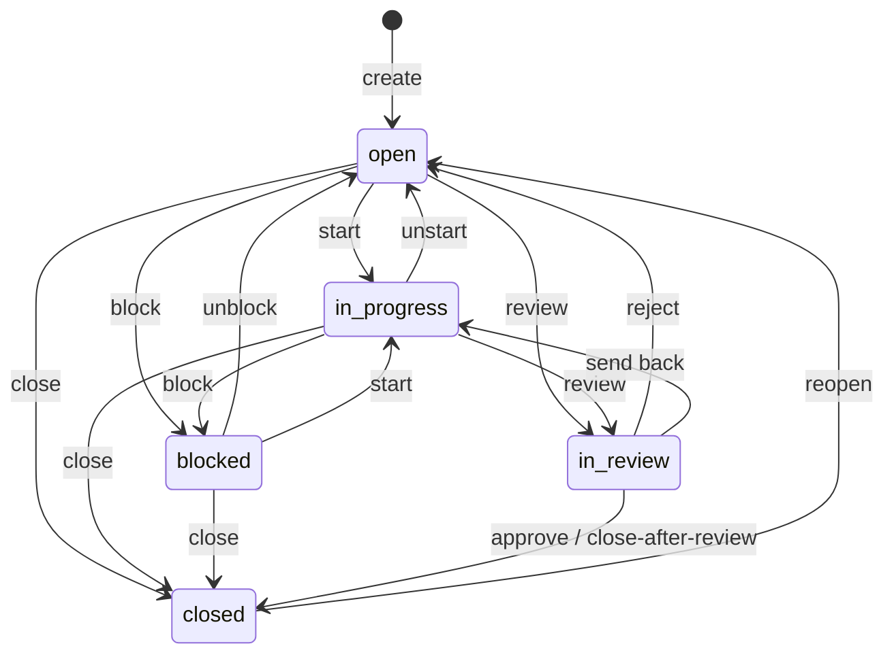
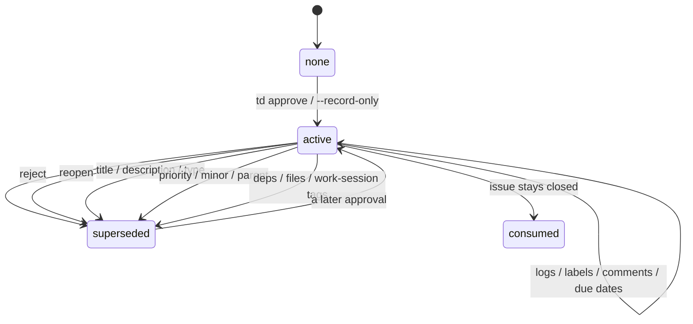
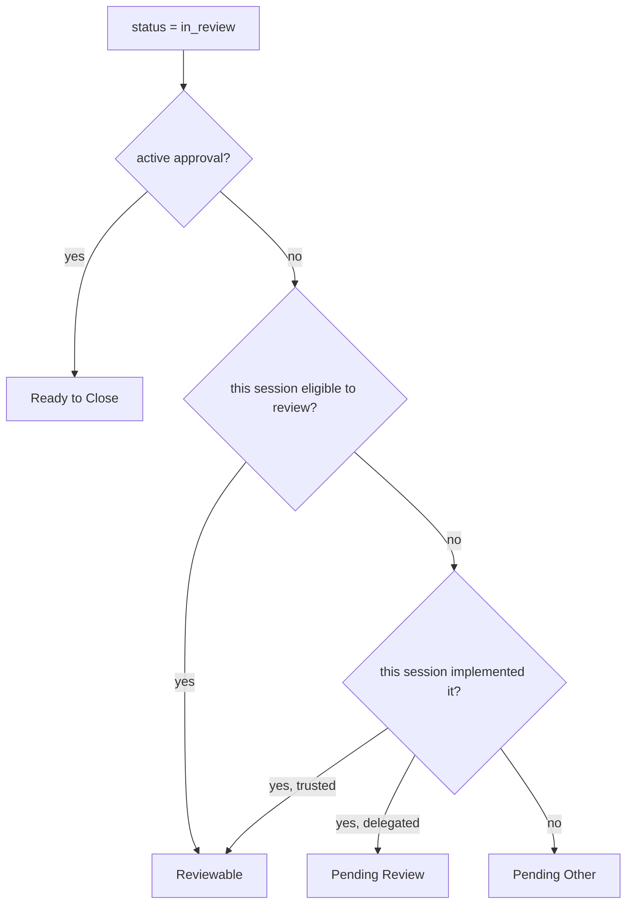

# Status and review

td looks like one workflow. It is two.

**Status** is where the issue is: `open`, `in_progress`, `blocked`, `in_review`, `closed`. Every `td start`, `td review`, `td approve`, `td reject`, `td reopen` is a status move. The official table lives in `internal/workflow/transitions.go`.

**Approval** is a separate row in `issue_reviews`. It answers a different question: has someone attested that this work is good enough to close? That row has its own life. It can be active, superseded, or absent, and status does not automatically drag it along.

The monitor buckets — Reviewable, Ready to Close, Pending Review, Pending Other — are not a third machine. They are a projection of those two facts plus "who is this session?" If a row looks unlabeled or in the wrong lane, check both fields before assuming the renderer is wrong.

## Status

Most of these edges are liberal. The one with teeth is `in_review → closed`: that is approve, and review policy decides who may take it. Admin `td close` is a different door, meant for duplicates and won't-fix, not for "the work is done."

`td show` and a lot of CLI copy look only at status. `in_review` means "this is in the review part of the workflow." It does not mean "this still needs a reviewer."

## Approval

An approval is `issue_reviews.superseded_at IS NULL` and `decision` in (`approved`, `approved_by_parent_cascade`). `GetActiveApprovalReview` is the lookup. Trusted and delegated mode treat `in_review` + that row as Ready to Close: any session may finish the close, because independence was already enforced when the approval was recorded.

Close does not supersede its own approval. If it did, close-after-review would eat the attestation it just used. Logs, labels, comments, and due dates also leave it alone — bookkeeping is not a new review epoch.

Reopen does supersede. The approval answered "this work is good enough to close." Reopen is someone saying that conclusion is no longer the current question. Reject already did this (leave `in_review` without closing). Reopen is the same idea, coming from the other side of `closed`.

A later `td review` does not need its own special case. Once reopen has retired the old row, the next submit lands in Reviewable (or Pending Review / Pending Other), not Ready to Close.

## How they compose

For an `in_review` issue, trusted/delegated classification is roughly:

Trusted puts the implementer in Reviewable even without an approval, because `td approve --reviewed-by` / `--self-review` is a real action from that session. Delegated has no such hatch, so the implementer waits in Pending Review.

Strict and balanced collapse this back to Reviewable vs Pending Review. Ready to Close stays empty there.

Needs Rework is a different overlay: `in_progress` plus a prior rejection. It is not an approval state.

## A cycle that used to leak

Approve and close, then reopen, start, submit again. Status is `in_review`. The old approval was still active, so the monitor drew Ready to Close. `td show` said awaiting review. Both were right about different fields.

That leftover row is what reopen now retires. The review history is still there; `superseded_at` is set. A new cycle needs a new attestation.

## Where this lives

| Question | Look here |
|---|---|
| Which status edges exist? | `internal/workflow/transitions.go` |
| Who may review or close? | `internal/reviewpolicy` |
| What retires an approval? | `reviewpolicy.IssueMutation`, `db.reviewInvalidatingDiff` |
| How does the monitor label a row? | `pkg/monitor/data.go` (`categorizeInReviewIssue`) |
| CLI buckets | `td status`, `td reviewable` |

Policy modes (`trusted`, `delegated`, `strict`, `balanced`) change who may act. They do not change the two-machine split. Status still moves. Approvals still persist or get superseded. The buckets just answer "what can *this* session do right now?"
